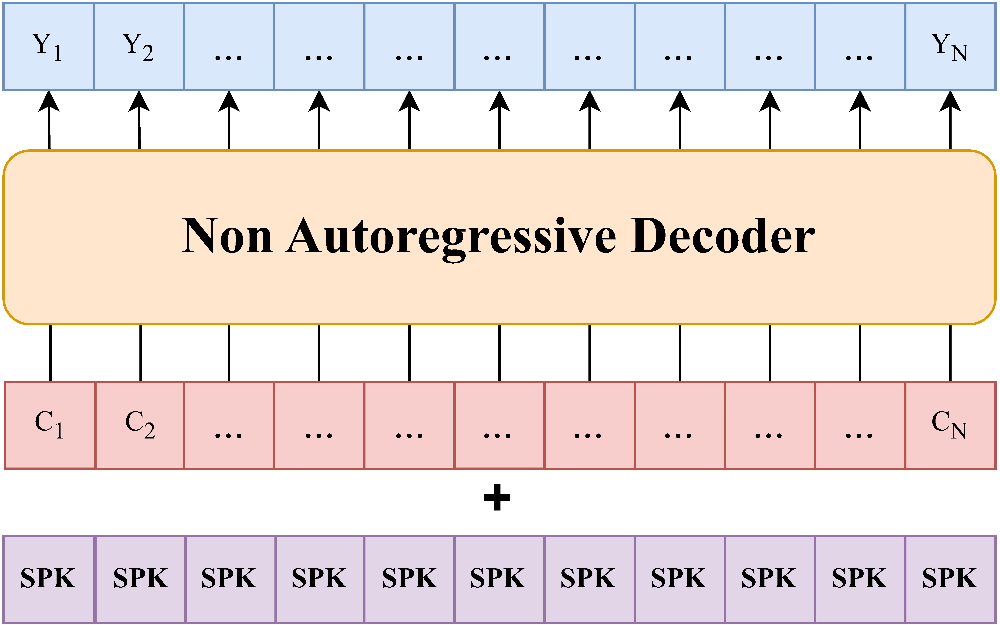

# 🐱 CATTS: Character-Aligned Text-to-Speech with DyCAST Tokens


CATTS is a **non-autoregressive** text-to-speech model built on top of [DyCAST](https://github.com/lucadellalib/dycast) tokens.
It takes a sequence of characters as input and predicts character-aligned speech tokens in parallel.

Because DyCAST provides a one-to-one mapping between characters and speech tokens along the time axis, CATTS can use a standard
non-autoregressive LLaMA-based encoder to predict one speech token per character. This makes inference extremely fast compared to
autoregressive speech generation approaches, since all tokens are generated simultaneously.

Given a character sequence and a speaker embedding extracted from a reference prompt, CATTS can synthesize speech in the target voice.
It can also leverage DyCAST voice-cloning capabilities by using additional reference audios during decoding, improving speaker similarity
and voice transfer quality.

**Reference**: [Beyond Fixed Frames: Dynamic Character-Aligned Speech Tokenization](https://arxiv.org/abs/2601.23174)



---------------------------------------------------------------------------------------------------------

## 🛠️️ Installation

First of all, install [Python 3.8 or later](https://www.python.org). Then, open a terminal and run:

```
pip install huggingface-hub numpy safetensors soundfile torch torchaudio torchcodec transformers
```

---------------------------------------------------------------------------------------------------------

## ▶️ Quickstart

**NOTE**: the `audios` directory contains audio samples that you can download and use to test the model.

You can easily load the model using `torch.hub` without cloning the repository:

```python
import os
import time

import torch
import torchaudio

device = "cuda" if torch.cuda.is_available() else "cpu"

# Load model
tts = torch.hub.load(
    repo_or_dir="lucadellalib/catts",
    model="catts",
    release="v0.0.1",
    force_reload=True,  # Fetch the latest version from Torch Hub
)
tts = tts.to(device)
tts.eval()

# Text prompt
text = ["What do you mean, sir?"]

# Load audio prompt for voice cloning
prompt_audio, sample_rate = torchaudio.load("audios/prompt.wav")
prompt_audio = torchaudio.functional.resample(
    prompt_audio, sample_rate, tts.sample_rate
)
prompt_audio = prompt_audio.to(device)

# Load additional reference audios to improve voice cloning quality
reference_audios = []
for filename in sorted(os.listdir("audios/reference")):
    filepath = os.path.join("audios/reference", filename)
    reference_audio, sample_rate = torchaudio.load(filepath)
    reference_audio = torchaudio.functional.resample(
        reference_audio, sample_rate, tts.sample_rate
    )
    reference_audio = reference_audio.to(device)
    reference_audios.append(reference_audio)
matching_pool = tts.build_matching_pool(reference_audios)

# Run the model
start_time = time.time()
generated_audio = tts(
    text=text,
    prompt_audio=prompt_audio,
    matching_pools=[matching_pool],
).cpu()
generation_time = time.time() - start_time

# Save generated audio (compare with the target audio in audios/target.wav)
torchaudio.save("generated.wav", generated_audio, tts.sample_rate)
generated_duration = generated_audio.shape[-1] / tts.sample_rate
rtf = generated_duration / generation_time
print(f"Generated duration: {generated_duration:.2f} seconds")
print(f"Real-Time Factor (RTF): {rtf:.3f}")
```

---------------------------------------------------------------------------------------------------------

## @ Citing

```bibtex
@article{dellalibera2026dycast,
    title   = {Beyond Fixed Frames: Dynamic Character-Aligned Speech Tokenization},
    author  = {Luca {Della Libera} and Cem Subakan and Mirco Ravanelli},
    journal = {arXiv preprint arXiv:2601.23174},
    year    = {2026},
}
```

---------------------------------------------------------------------------------------------------------

## 📧 Contact

[luca.dellalib@gmail.com](mailto:luca.dellalib@gmail.com)

---------------------------------------------------------------------------------------------------------
